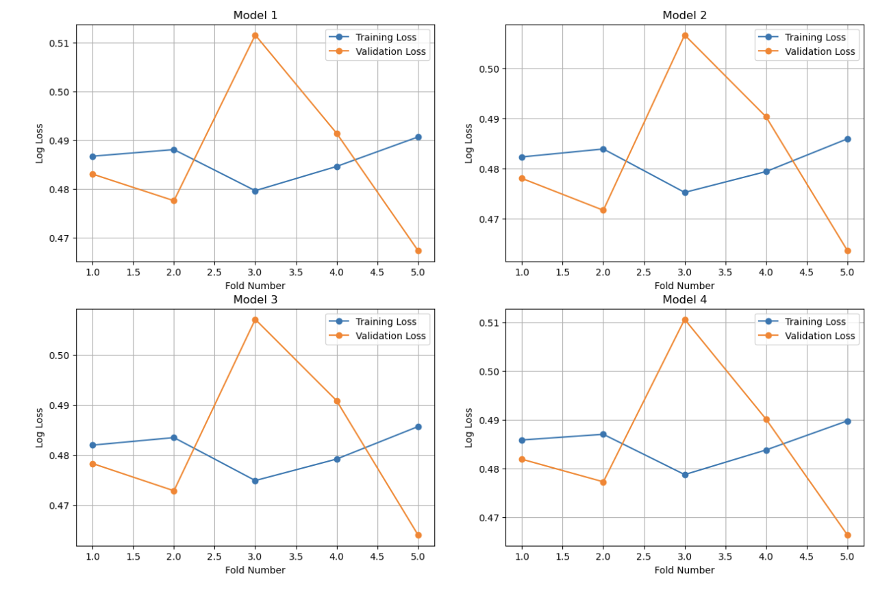

# Project 2: Predicting Flight Delays with Logistic Regression and Classification Techniques

## Project Overview
In this project, I will be attempting to predict whether a flight will be delayed or not depending on measurable characteristics about the flight such as departure time, weather conditions, and airline specifics.

## Objectives

1. **Exploratory Data Analysis (EDA):**
   - Conduct a thorough examination of the dataset to uncover patterns and anomalies that could influence flight delays.
   - Visualize key variables and explore their relationships.
   
2. **Model Development and Evaluation:**
   - Implement and compare several classification models to identify the most effective approach for predicting flight delays.
   - Models will vary in complexity, from simple logistic regression to more sophisticated ensemble methods.
   
3. **Performance Assessment:**
   - Investigate how adjusting the classification threshold impacts the precision, recall, and overall accuracy of the predictive models.
   - Fine-tune the models for practical deployment scenarios.

## Skills Utilized

- Data cleaning and preprocessing using Pandas
- Handling missing values and anomalies in datasets
- Exploratory Data Analysis (EDA)
- Data visualization using Matplotlib and Seaborn
- Model development and evaluation using Scikit-learn
- Performance assessment and tuning

## Data Preparation

### Obtaining the Data

- The data was obtained from a public data repository related to U.S flight operations.
- The main datasets used are `flightdelay.csv` and `airport_coordinates.csv`.

### Data Cleaning

- Standardized the airport names to facilitate merging of datasets.
- Dropped NAs and merged datasets on the airport names.

## Exploratory Data Analysis

### Sample Visualizations

### Summary of Findings

1. **Probability of Delay by Month:** February, May through August, and December have higher probabilities of flight delays. This could be due to increased travel during these months and potential weather conditions.
   
2. **Probability of Delay by Hour:** The probability of delay increases each hour starting at 6am, peaking at 7pm or 9pm, potentially due to increased airport and air traffic.

3. **Probability of Delay by Airline:** JetBlue Airways and Frontier Airlines Inc. have the highest probabilities of delays, while Hawaiian Airlines Inc. has the lowest.

4. **Probability of Delay vs Snow:** There isn't a strong correlation between the amount of snow and the probability of delay, although most data points had between 0-2 inches of snow.

## Model Development

### Models and Features

- **Model 1:** Uses `MONTH`, `DAY_OF_WEEK`, and `TMAX`.
- **Model 2:** Uses `MONTH`, `AWND`, `TMAX`, `SNOW`, and `PRCP`.
- **Model 3:** Uses continuous features such as `LATITUDE`, `LONGITUDE`, `AWND`, `TMAX`, `SNOW`, `PRCP`, `SNWD`, and `CONCURRENT_FLIGHTS`.
- **Model 4:** Uses only `SNOW`.

### Cross-Validation

- Implemented 5-fold cross-validation to compute training and validation errors.
- **Model 2** had the best performance with an average validation log loss of approximately 0.4820.

### Performance Assessment

- **Accuracy:** 81.11%
- **Precision:** 53.75%
- **Recall:** 0.7%

### Threshold Adjustment

- Adjusted the classification threshold to match the proportion of delayed flights in the dataset.
- **Accuracy:** 63.41%
- **Precision:** 23.63%
- **Recall:** 42.24%

### Random Guess Comparison

- Compared model performance to a completely random guess.
- The model outperformed the random guess, particularly in recall (42.24% vs 18.90%).

## Conclusion

Predicting flight delays is challenging due to the complex interplay of factors. While the models developed offer some predictive capability, their utility as decision-making tools is limited by relatively low precision and recall. Future improvements could involve incorporating additional data sources or more sophisticated modeling techniques.

## Files

- **project2_flight_delays.ipynb:** Contains the data cleaning, EDA, and model development steps.
- **data/flightdelay.csv:** Raw flight delay data.
- **data/airport_coordinates.csv:** Airport coordinates data.
- **Images/barplot_proj2.png:** Bar plot of probability of flight delay by month.
- **Images/regplot_proj2.png:** Logistic regression plot of probability of delay vs snow.
- **Images/lineplots_proj2.png:** Training and validation loss for each model.
