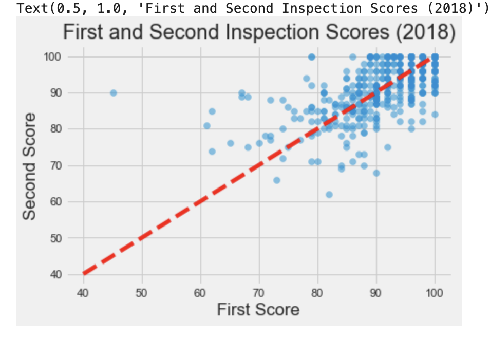

# Food Safety Project

## Overview

This project investigates restaurant food safety scores for restaurants in San Francisco. The scores and violation information have been made available by the San Francisco Department of Public Health. The main goal for this assignment is to walk through the process of Data Cleaning and Exploratory Data Analysis (EDA).

## Objectives

- Practice reading simple CSV files and using Pandas
- Work with data at different levels of granularity
- Identify the type of data collected, missing values, anomalies, etc.
- Explore characteristics and distributions of individual variables

## Collaboration Policy

Data science is a collaborative activity. While you may talk with others about the project, we ask that you write your solutions individually. If you do discuss the assignments with others, please include their names at the top of your notebook.

**Collaborators:** List collaborators here

## Skills Utilized

- Data cleaning and preprocessing using Pandas
- Handling missing values and anomalies in datasets
- Exploratory Data Analysis (EDA)
- Data visualization using Matplotlib and Seaborn

## Data Preparation

### Obtaining the Data

The data is obtained from a zip file `data.zip` containing multiple CSV files. The files are unzipped and read into Pandas dataframes for analysis.

### Data Cleaning

- Renamed columns for clarity
- Checked and ensured uniqueness of primary keys
- Identified and handled invalid ZIP codes
- Merged dataframes to enrich the dataset with additional information

### Data Exploration

- Investigated the granularity and primary keys of the datasets
- Analyzed the inspection data and identified trends over time
- Examined the distribution of inspection scores and other relevant metrics

## Exploratory Data Analysis

### Sample Visualizations

### Summary of Findings

- **Inspection Scores Distribution:** The distribution of inspection scores is skewed left, with most scores being above 90.
- **Restaurant Improvement:** Identified the restaurant with the most significant improvement in scores.
- **Yearly Trends:** Analyzed the number of inspections and scores over the years.
- **Score Differences:** Examined the differences in inspection scores for businesses with multiple inspections in a year.

## Usage

To run the project, you need to have the following installed:

- Python 3.x
- pandas
- numpy
- matplotlib
- seaborn

## Files

- **food_safety_project.ipynb:** Contains the data cleaning, EDA, and analysis steps.
- **data.zip:** Compressed file containing the raw data.
- **Images/proj1_scatterplot.png:** Visualization of inspection scores scatter plot.

## Conclusion

This project highlights the importance of data cleaning and exploratory analysis in understanding and interpreting food safety scores. The insights gained from the analysis can help identify areas of improvement and ensure better food safety practices in restaurants.
